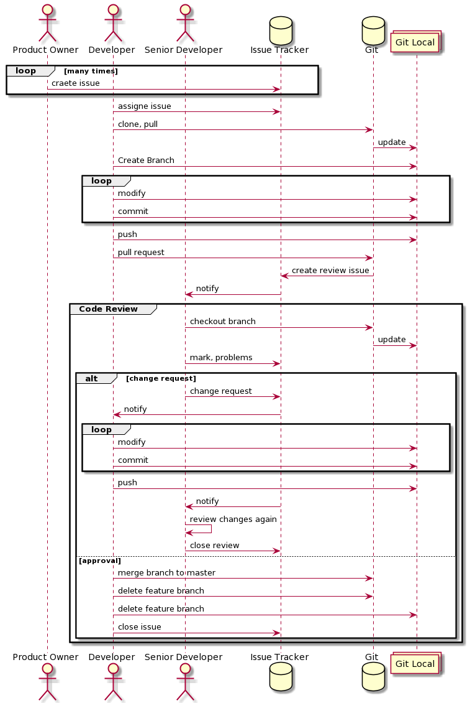

# project-templates-python

Project Templates - Python

---

# Workflow



## Steps

1.Issues are defined by Product Owner, Senior Developer or Developer. During the definition of the issues, you should
use the Issue Template. Bigger issues may contains user stories that can be split into smaller ones. You shall estimate
the cost of the task by using Story Points. Each issue should contain a list of acceptance criteria AC.

2. The issue is assigned to you. You have to pull the changes and create a new branch for the issue. Branch name should
   contain the issue id and the name of the issue.

```
#<issue_id>_<name_of_the_issue>
#3_refactor_polynomial_module
#4_make_a_coffee
```

3. During the development you should commit often. You shall use
   the [Conventional Commits](https://www.conventionalcommits.org/en/v1.0.0/)

4. When you are ready, you have to make a pull request. Pull Requests will be reviewed by a Senior Developer. Usually,
   at least the approval of 2 Senior Developer is required.    
   Changes may be requested. If your changes are aproved, then you shall merge your code. If the master branch changed
   then you shall merge the master branch into your branch. Github has to do all merge automatically!

5. When your code is merged. You have to delete your feature branch on the server. Do not forget to delete your local
   branch too.

---

# Project Structure

```
.
|-- ci.Dockerfile
|-- etc
|-- .git
|-- .github
|-- .gitignore
|-- .idea
|-- main.py
|-- Pipfile
|-- Pipfile.lock
|-- __pycache__
|-- README.md
|-- requirements.txt
|-- src
`-- tests

7 directories, 7 files


```

- ci.Dockerfile - Dockerfile for Unit Tetsing during the Continuous Integration Pipeline. Do not touch it!
- etc - End of Thinking Capacity. Figures and other loosely coupled resources are placed here. Useful for the template.
- .git - [Can't touch this](https://www.youtube.com/watch?v=otCpCn0l4Wo&ab_channel=MCHammerVevo)
- .github - Configuration of Github Actions. Continuous Integration Pipelines.
- .gitignore - Ignores files for git. Configured for the project. Extend if it is necessary. You should not add
  generated contents.
- .idea - Ignored. Related to the IDEA. [PyCharm](https://www.jetbrains.com/pycharm/) is charming.
- main.py - Entry point of your application.
- Pipfile - List of dependencies of Python and pipenv
- Pipfile.lock - Generated. Ignored.
- pycache - Ignored.
- README.md - Nobody reads it.
- requirements.txt - generated and ignored.
- src - Put your source files, modules here. Pylint will check file in this directory.
- tests - Put your tests here. CI will run tests in this directory.

---

# Continuous Intergation - Quality Gate

Continuous Integration pipelines run for each push. Two jobs will run that are Style checking and Testing.

1. styel - Pylint will check the style of your code. It has a default configuration. It check the PEP8 Standard. Build
   Fails if your score is below 9.5.

2. tests - Run the unittest module in a docker container built by the ci.Dockerfile. You shall test your code according
   to the [F.I.R.S.T. Principles](https://medium.com/@tasdikrahman/f-i-r-s-t-principles-of-testing-1a497acda8d6). The
   build fails if any test fails. The build fails if the code coverage of the src/ directory is bellow 80%.

---

# Definition of Done

1. Quality Gate passed
2. Code Reivew was performed.
3. Acceptance Criteria are met.

---

# Useful Commands

Calculate code coverage.

```bash 
coverage run --source src/ -m unittest discover --start-directory tests/ --pattern "*.py" && coverage report --fail-under=80
```